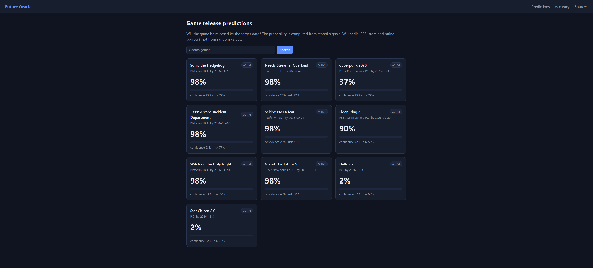

# Future Oracle — предсказатель дат релизов игр

Прототип для тестового задания **Future Oracle**. Тема: **даты релизов видеоигр**.

Система собирает данные о будущих играх из реальных открытых источников, хранит сырые
записи и нормализованные сигналы, считает вероятность релиза с уверенностью и риском,
а позже проверяет себя по фактическому исходу (оценка Брайера).

Это не рандомайзер: каждый прогноз пересчитывается из строк, сохранённых в базе, поэтому
цифры на странице всегда соответствуют данным.

Использование AI (OpenCode):
 - Структура проекта;
 - Тесты;
 - Frontend;
 - README.

---
## Интерфейс приложения



## Запуск

```bash
python -m venv .venv
.venv\Scripts\activate         # Windows
pip install .                  # установка пакетов
pip install -e ".[dev]"        # для pytest

python -m scripts.seed_db      # офлайн-демо (источники + 6 игр + сигналы + прогнозы)
fastapi run                    # production-режим
```

Для разработки с авто-перезагрузкой:

```bash
fastapi dev app/main.py
```

Откройте http://127.0.0.1:8000

Тесты запускаются без сервера (`TestClient` из FastAPI работает без него):

```bash
pytest
```

Страницы:

- `/` — сетка игр с текущей вероятностью
- `/events/{id}` — карточка прогноза: вероятность, уверенность, риск, аргументы,
  разбивка сигналов, сырые записи, форма ручного разрешения
- `/accuracy` — разрешённые события vs вероятность → оценка Брайера
- `/sources` — список источников данных с их надёжностью

API (те же данные в формате JSON):

- `GET /api/events`, `GET /api/events/{id}`
- `POST /api/events/{id}/predict` — пересчитать прогноз по сохранённым сигналам
- `POST /api/events/{id}/resolve` — `{"outcome": true|false}` → помечает событие
  разрешённым и сохраняет оценку Брайера
- `GET /api/sources`, `GET /api/accuracy`, `GET /api/health`

### Сбор реальных данных

```bash
python -m scripts.collect
```

Что это делает:

1. **Wikipedia-коллектор** — парсит страницу года (по умолчанию `2026 in video games`),
   извлекает названия игр и даты релизов из таблиц, создаёт события `events` и сигналы
   `official_date_confirmed`. Таблицы фильмов/сериалов и игр, которые были *закрыты*
   (shutdown), отфильтровываются; оставляются только записи с датами в году страницы.
   Сила сигнала зависит от точности даты (день=1.0, месяц=0.85, квартал=0.7, год=0.5).
   Страницу можно изменить через `FO_wikipedia_page`.
2. **RSS-коллектор** — загружает игровые ленты (GameSpot, Eurogamer, BBC Tech),
   нечётко сопоставляет заголовки статей с отслеживаемыми играми (пересечение токенов),
   сохраняет сырые записи.
3. **Коллектор магазинов** — ищет отслеживаемые игры в Epic Games Store (GraphQL),
   GOG (catalog API) и Steam Store (search + appdetails API), нечётко сопоставляет
   названия с результатами поиска и сохраняет листинги: название продукта, ссылку,
   дату релиза и флаг «coming soon».
4. **Нормализатор** — превращает сырые записи в сигналы: RSS → `news_mention_recent`
   (значение свежести 0.9 / 0.6 / 0.3); листинги магазинов → `official_date_confirmed`
   (дата релиза в будущем) и `preorder_open` (будущая дата или «coming soon»).
5. **Пересчёт** — генерирует свежий прогноз для каждого активного события.
6. **Авторазрешение** — события с прошедшей целевой датой проверяются по магазинным
   листингам и помечаются `resolved` с расчётом Brier (подробнее ниже).

Не зависящие от сети демо-данные создаются командой `python -m scripts.seed_db`, чтобы
приложение работало офлайн. Реальные данные накапливаются поверх них.

Опциональное фоновое обновление (APScheduler): установите `FO_enable_scheduler=true`
(переменная окружения или `.env`) — тогда прогнозы пересчитываются каждые
`FO_collect_interval_minutes` минут.

## Источники данных

| Источник | Тип | Надёжность | Для чего |
|---|---|---|---|
| Wikipedia (`2026 in video games`) | wikipedia | 0.8 | официальные даты релизов |
| Epic Games Store | store | 0.7 | предзаказы, даты релизов |
| GOG | store | 0.7 | предзаказы, даты релизов |
| Steam Store | store | 0.8 | предзаказы, даты релизов |
| GameSpot RSS | rss | 0.7 | упоминания в новостях, фаза разработки |
| Eurogamer RSS | rss | 0.6 | упоминания в новостях, фаза разработки |
| BBC Tech RSS | rss | 0.5 | упоминания в новостях, фаза разработки |
| ESRB (демо) | ratings | 0.9 | рейтинговые листинги |

`reliability` — это экспертная оценка надёжности источника в диапазоне 0–1; она снижает
уверенность, когда доказательства получены из слуховых фидов.

## Схема базы данных

### Где хранится база

По умолчанию проект использует **SQLite** — база лежит одним файлом
`future_oracle.db` в корне проекта (тот каталог, из которого запущен процесс).
Это видно в `app/config.py`:

```
database_url = "sqlite:///./future_oracle.db"
```

Файл игнорируется Git (в `.gitignore`), поэтому он не попадает в репозиторий.
При запуске он создаётся автоматически (`init_db()` создаёт таблицы по ORM-моделям).

Путь можно переопределить через переменную окружения `FO_DATABASE_URL` (или `.env`),
например:

```bash
FO_DATABASE_URL="sqlite:///C:/data/oracle.db" python -m scripts.seed_db
```

Тесты используют отдельную базу `tests/test_oracle.db` (`tests/test_api.py` задаёт
`FO_DATABASE_URL` до импорта приложения) и удаляют её по завершении.

Чтобы начать с чистого листа, достаточно удалить `future_oracle.db` и выполнить
`python -m scripts.seed_db`.

### Таблицы
- `sources` — источники данных и их надёжность
- `events` — объект прогноза: игра + платформа + целевая дата; статус
  (`active`/`resolved`) и фактический `outcome` после разрешения
- `raw_records` — собранные статьи/строки с заголовком, url и payload
- `metrics` — нормализованные сигналы по каждому событию (`signal_type`, `value`,
  `weight`, `source_reliability`, `note` со ссылкой на сырую запись)
- `predictions` — одна строка на расчёт: `probability`, `confidence`, `risk`,
  `arguments` (текстовое объяснение), `breakdown` (вклад каждого сигнала)
- `resolutions` — записи о разрешении с последней `probability`, фактическим исходом
  и `brier_score`

Конвейер: `raw_records → metrics → predictions → resolutions`.

## Алгоритм

### Сигналы (веса)

Каждый сигнал — сила в диапазоне `[0, 1]`. Положительные веса повышают вероятность,
отрицательные — понижают.

| Сигнал | Вес | Значение |
|---|---|---|
| `official_date_confirmed` | +1.0 | реальный источник назвал дату |
| `rating_board_listing` | +0.8 | листинг в ESRB/PEGI (близость релиза) |
| `preorder_open` | +0.7 | открыты предзаказы в магазине |
| `dev_phase` | +0.6 | фаза разработки из новостей (полировка/gold) |
| `news_mention_recent` | +0.4 | свежие упоминания в прессе |
| `silent_period` | −0.5 | долго нет новостей |
| `delay_history` | −0.6 | в прошлом у студии/франшизы были переносы |

Веса настраиваются в `app/config.py` (`signal_weights`, `signal_labels`).

### Вероятность

```
probability = clamp( Σ (weight_i × value_i) / Σ |weight_i| , 0.02, 0.98 )
```

Это взвешенное среднее последнего сигнала каждого типа. Каждый прогноз хранит полный
`breakdown`, поэтому каждая цифра прослеживается до сохранённой метрики.

### Уверенность

```
coverage      = 1 − e^(−N/3)          (N — число независимых сигналов)
agreement     = 1 − (max−min знаковых сил сигналов)
reliability   = средняя надёжность источников
confidence    = clamp( coverage × (0.5 + 0.5 × agreement) × reliability , 0.02, 0.98 )
risk          = 1 − confidence
```

Уверенность растёт с количеством доказательств, согласованностью источников и их
официальностью. `risk_reasons` перечисляет обнаруженные негативные сигналы.

### Как система понимает, что ошиблась

Событие можно разрешить автоматически или вручную:

- **Автоматически** — `python -m scripts.collect` (и фоновый scheduler) запускает
  `app/resolver.py`: для активных событий с прошедшей целевой датой ищется магазинный
  листинг с **точным** совпадением названия игры (защита от ложных фаззи-совпадений).
  Если дата релиза в магазине раньше или равна целевой — исход `True`, если позже —
  `False`. Без подтверждающего листинга событие остаётся активным (чтобы не начислить
  ошибочный Brier).
- **Вручную** — форма на карточке события или `POST /api/events/{id}/resolve`.

```
Brier = (probability − outcome)²        outcome ∈ {0, 1}
```

Результат сохраняется в `resolutions` и отображается на `/accuracy`. Низкий средний
Brier означает, что модель хорошо откалибрована. Разрешённые события не показываются
в сетке прогнозов и в `GET /api/events` — они остаются доступны на `/accuracy`.

### Цифры, которые должны сходиться

- Вероятность на странице равна `Σ(w×v)/Σ|w|`, вычисленной по строкам `metrics` этого
  события — и никогда не генерируется случайно.
- Повторный запуск `POST /api/events/{id}/predict` без новых метрик возвращает то же
  значение.
- `scripts/collect.py` выводит вероятности, пересчитанные из тех же сохранённых сигналов.
- `brier_score` на `/accuracy` равен квадрату `(последняя вероятность − исход)`.

## Использование AI

Этот прототип не использует LLM при работе алгоритма. Правила, веса и скоринг детерминированы и полностью
объяснимы.
## Структура проекта

```
app/
├── main.py                 # FastAPI-приложение, страницы, подключение шаблонов
├── config.py               # настройки: веса, фиды, страница Wikipedia
├── database.py             # движок / сессия SQLAlchemy
├── resolver.py             # авторазрешение событий по магазинным листингам
├── models/                 # ORM-модели (events, sources, raw_records, metrics, ...)
├── schemas/                # Pydantic-модели ответов
├── collectors/             # wikipedia_collector.py, rss_collector.py, store_collector.py
├── normalizers/signals.py  # raw records → metrics
├── scoring/predictor.py    # вероятность, уверенность, риск, Brier
├── storage/repository.py   # запросы к БД
├── api/                    # JSON-эндпоинты
├── scheduler.py            # фоновый пересчёт на APScheduler
├── templates/ static/      # Jinja2-интерфейс + CSS
scripts/                    # seed_db.py, collect.py
tests/                      # pytest: юнит-тесты скоринга + интеграционные тесты API
```

## Дальнейшие шаги

- Коллекторы IGDB/RAWG (бесплатные API-ключи) для сигналов `dev_phase` и `preorder_open`.
- LLM-классификатор новостей для фазы разработки со слоем сохранения фактов.
- Страница калибровки Brier (средний балл, разбивка по диапазонам уверенности).
